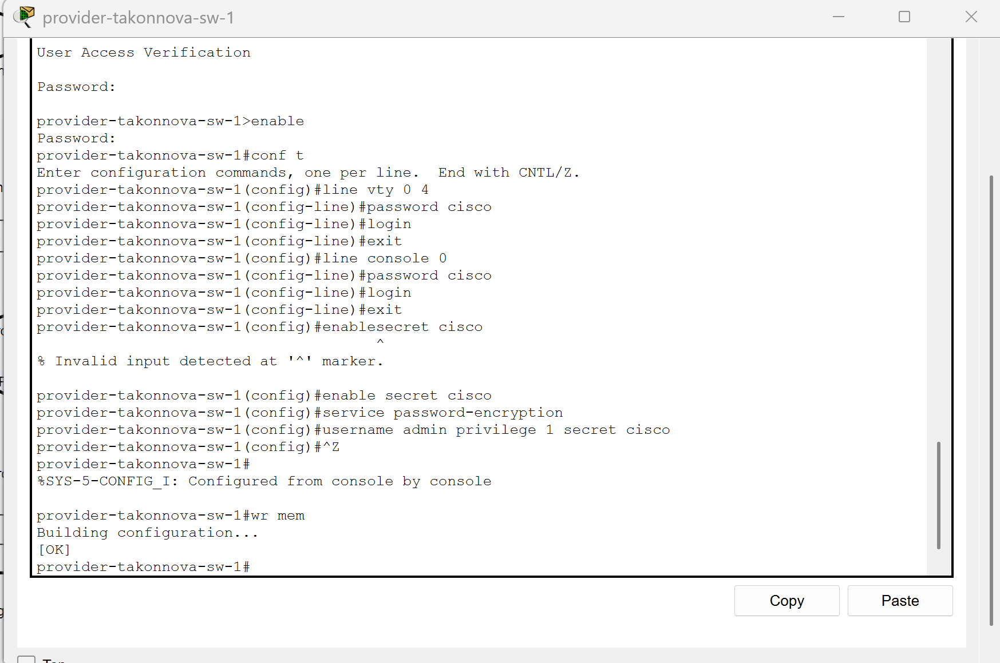
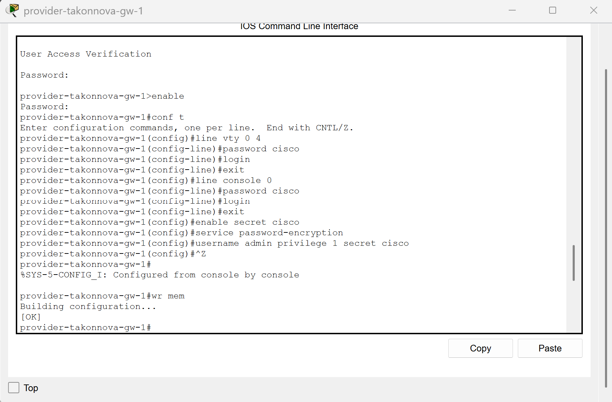
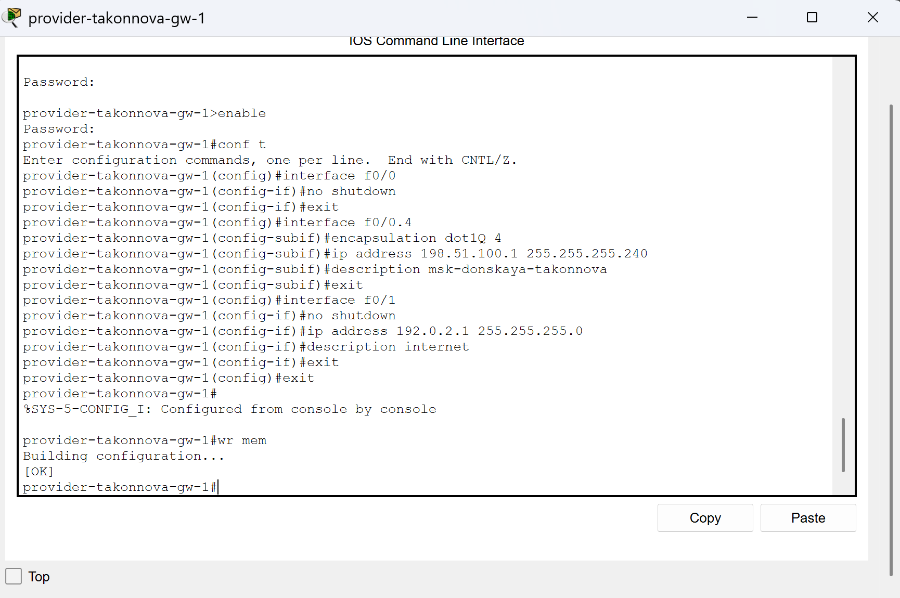
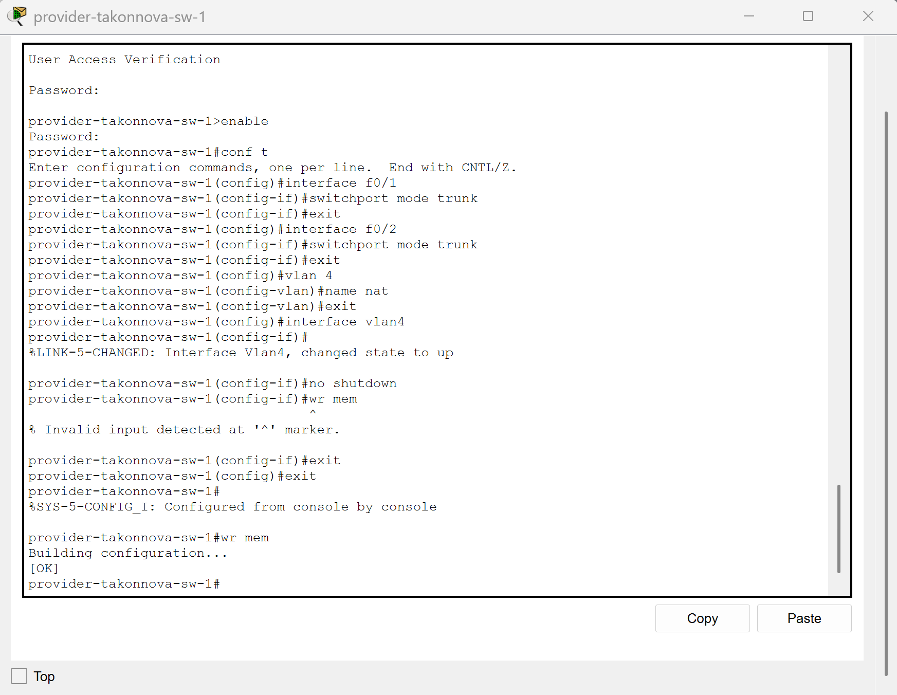
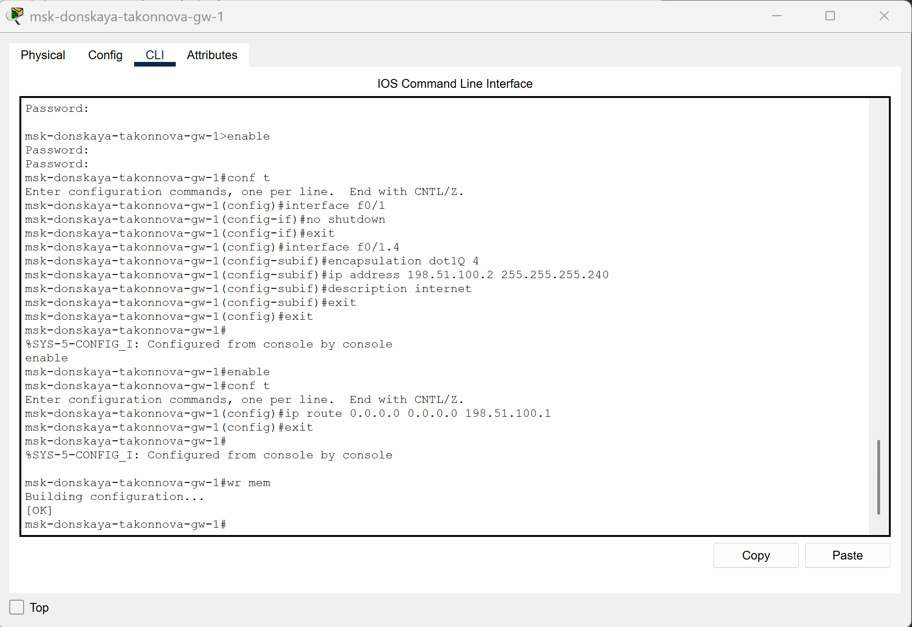
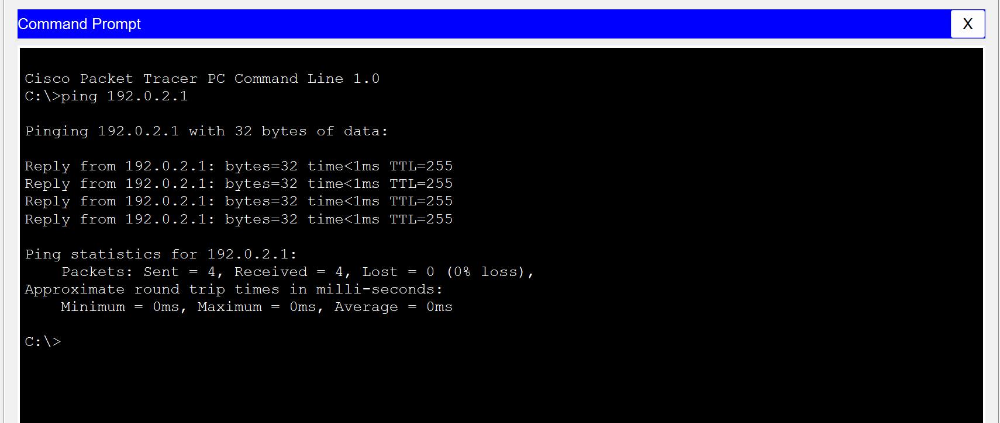
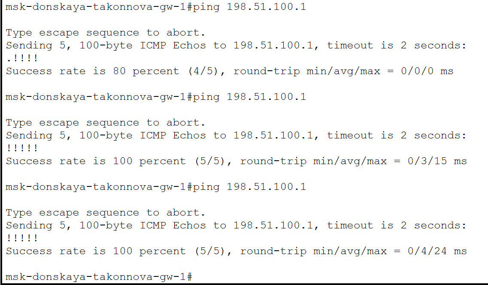
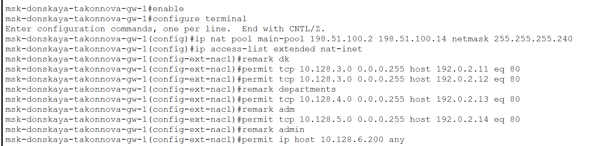
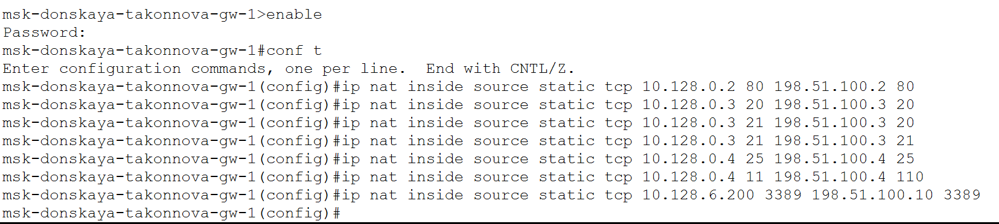
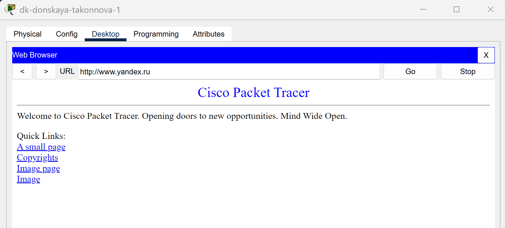

---
## Front matter
lang: ru-RU
title: Лабораторная работа №12
subtitle: Настройка NAT
author:
  - Коннова Т. А.
institute:
  - Российский университет дружбы народов, Москва, Россия

## i18n babel
babel-lang: russian
babel-otherlangs: english

## Formatting pdf
toc: false
toc-title: Содержание
slide_level: 2
aspectratio: 169
section-titles: true
theme: metropolis
header-includes:
 - \metroset{progressbar=frametitle,sectionpage=progressbar,numbering=fraction}
 - '\makeatletter'
 - '\beamer@ignorenonframefalse'
 - '\makeatother'
---

# Информация

## Докладчик

:::::::::::::: {.columns align=center}
::: {.column width="70%"}

  * Коннова Татьяна Алексеевна
  * студент
  * Российский университет дружбы народов
  * [1132221814@pfur.ru](mailto:1132221814@pfur.ru)

:::
::: {.column width="25%"}

:::
::::::::::::::

# Вводная часть

## Цель работы

Приобрести практические навыки по настройке доступа локальной сети к внешней сети посредством NAT.

## Задание

1. Сделать первоначальную настройку маршрутизатора provider-gw-1 и коммутатора provider-sw-1 провайдера: задать имя, настроить доступ по
паролю и т.п.
2. Настроить интерфейсы маршрутизатора provider-gw-1 и коммутатора
provider-sw-1 провайдера.
3. Настроить интерфейсы маршрутизатора сети «Донская» для доступа к сети
провайдера.
4. Настроить на маршрутизаторе сети «Донская» NAT с правилами.
5. Настроить доступ из внешней сети в локальную сеть организации.
6. Проверить работоспособность заданных настроек.
7. При выполнении работы необходимо учитывать соглашение об именовании.

## Выполнение лабораторной работы

: Распределение ip-адресов модельного Интернета {#tbl:ip}

| IP-адреса     | Примечание            |
|---------------|-----------------------|
| 192.0.2.1     | provider-gw-1         |
| 192.0.2.11    | www.yandex.ru         |
| 192.0.2.12    | stud.rudn.university  |
| 192.0.2.13    | esystem.pfur.ru       |
| 192.0.2.14    | www.rudn.ru           |

## Выполнение лабораторной работы

{#fig:001 width=70%}

## Выполнение лабораторной работы

{#fig:002 width=70%}

## Выполнение лабораторной работы

{#fig:003 width=70%}

## Выполнение лабораторной работы

{#fig:0041 width=70%}

## Выполнение лабораторной работы

{#fig:005 width=70%}

## Выполнение лабораторной работы.

{#fig:006 width=70%}

## Выполнение лабораторной работы

{#fig:007 width=70%}

## Выполнение лабораторной работы

{#fig:0081 width=70%}

## Выполнение лабораторной работы

{#fig:008 width=70%}

## Выполнение лабораторной работы

{#fig:009 width=70%}

## Выполнение лабораторной работы

{#fig:0091 width=70%}

## Выполнение лабораторной работы

{#fig:0092 width=70%}

## Выполнение лабораторной работы

{#fig:0093 width=70%}

## Выполнение лабораторной работы

{#fig:00936 width=70%}

## Выводы

В процессе выполнения данной лабораторной работы я провела подготовительные мероприятия по подключению локальной сети организации к Интернету.