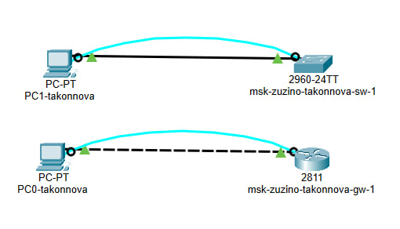
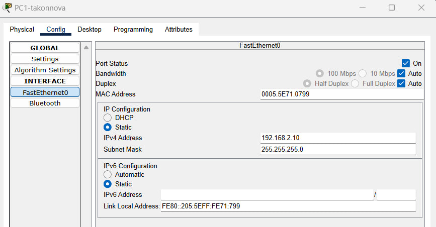
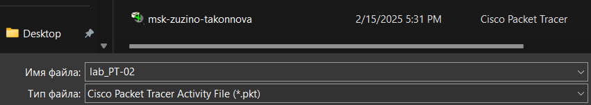
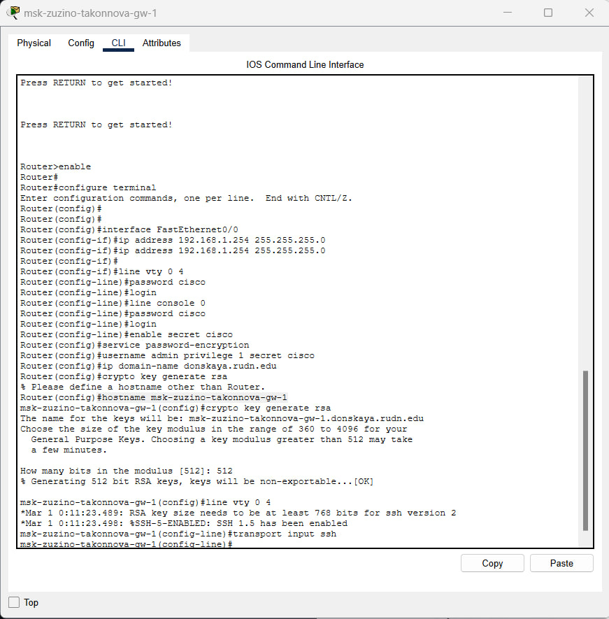
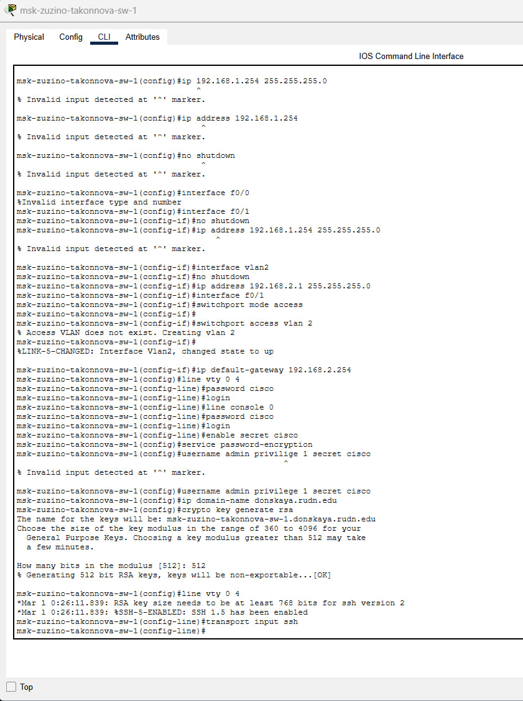
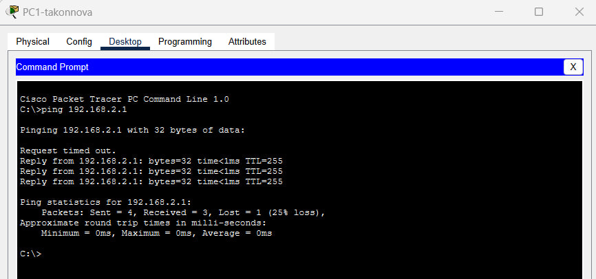
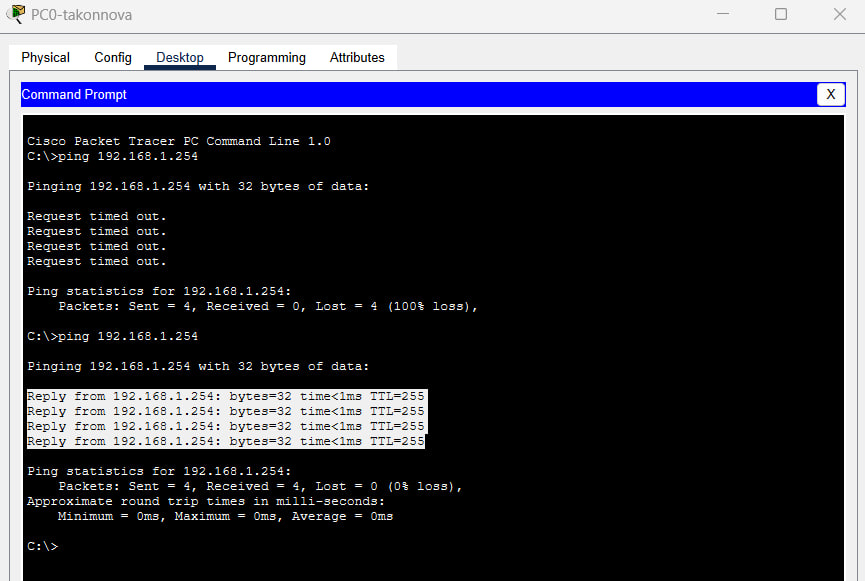

---
## Front matter
title: "Лабораторная работа №2"
subtitle: "Предварительная настройка оборудования Cisco"
author: "Коннова Татьяна Алексеевна"

## Generic otions
lang: ru-RU
toc-title: "Содержание"

## Bibliography
bibliography: bib/cite.bib
csl: pandoc/csl/gost-r-7-0-5-2008-numeric.csl

## Pdf output format
toc: true # Table of contents
toc-depth: 2
lof: true # List of figures
lot: false # List of tables
fontsize: 12pt
linestretch: 1.5
papersize: a4
documentclass: scrreprt
## I18n polyglossia
polyglossia-lang:
  name: russian
  options:
	- spelling=modern
	- babelshorthands=true
polyglossia-otherlangs:
  name: english
## I18n babel
babel-lang: russian
babel-otherlangs: english
## Fonts
mainfont: PT Serif
romanfont: PT Serif
sansfont: PT Sans
monofont: PT Mono
mainfontoptions: Ligatures=TeX
romanfontoptions: Ligatures=TeX
sansfontoptions: Ligatures=TeX,Scale=MatchLowercase
monofontoptions: Scale=MatchLowercase,Scale=0.9
## Biblatex
biblatex: true
biblio-style: "gost-numeric"
biblatexoptions:
  - parentracker=true
  - backend=biber
  - hyperref=auto
  - language=auto
  - autolang=other*
  - citestyle=gost-numeric
## Pandoc-crossref LaTeX customization
figureTitle: "Рис."
tableTitle: "Таблица"
listingTitle: "Листинг"
lofTitle: "Список иллюстраций"
lotTitle: "Список таблиц"
lolTitle: "Листинги"
## Misc options
indent: true
header-includes:
  - \usepackage{indentfirst}
  - \usepackage{float} # keep figures where there are in the text
  - \floatplacement{figure}{H} # keep figures where there are in the text
---

# Цель работы

Получить основные навыки по начальному конфигурированию оборудования Cisco.

# Задание

1. Сделать предварительную настройку маршрутизатора:

- задать имя в виде «город-территория-учётная_записьтип_оборудования-номер»;

- задать интерфейсу Fast Ethernet с номером 0 ip-адрес 192.168.1.254 и маску 255.255.255.0, затем поднять интерфейс;

- задать пароль для доступа к привилегированному режиму (сначала в открытом виде, затем — в зашифрованном);

- настроить доступ к оборудованию сначала через telnet, затем — через ssh (используя в качестве имени домена donskaya.rudn.edu);

- сохранить и экспортировать конфигурацию в отдельный файл.

2. Сделать предварительную настройку коммутатора:

- задать имя в виде «город-территория-учётная_записьтип_оборудования-номер» 
 
- задать интерфейсу vlan 2 ip-адрес 192.168.2.1 и маску 255.255.255.0, затем поднять интерфейс;

- привязать интерфейс Fast Ethernet с номером 1 к vlan 2;

- задать в качестве адреса шлюза по умолчанию адрес 192.168.2.254;

- задать пароль для доступа к привилегированному режиму (сначала в открытом виде, затем — в зашифрованном);

- настроить доступ к оборудованию сначала через telnet, затем — через ssh (используя в качестве имени домена donskaya.rudn.edu);

- для пользователя admin задать доступ 1-го уровня по паролю;

- сохранить и экспортировать конфигурацию в отдельный файл.

# Выполнение лабораторной работы

В логической рабочей области Packet Tracer разместим коммутатор, маршрутизатор и 2 оконечных устройства типа PC, соединим один PC
с маршрутизатором консольным и кроссовым кабелем, другой PC — с коммутатором консольным и прямым кабелем (рис. [-@fig:001]).

{#fig:001 width=70%}

Для начала зададим статический ip-адрес PC1 192.168.2.10 с соответствующей маской подсети 255.255.255.0 (рис. [-@fig:002]).

{#fig:002 width=70%}

## Настройка маршрутизатора

Теперь проведем настройку маршрутизатора в соответствии с заданием. Откроем Command Line Interface (CLI) у маршрутизатора, который идентичен терминалу ПК. Для перехода в привилегированный режим из пользовательского режима воспользуемся командой `enable`. А для перехода в режим глобальной конфигурации из привилегированного режима используем команду `configure terminal` или её сокращённый аналог `conf t`. И в этом режиме зададим имя хоста, введя команду `hostname msk−donskaya −gw−1`, но перед этим зададим имя файлу (рис. [-@fig:003]).

{#fig:003 width=70%}

Проведём настройку маршрутизатора в соответствии с заданием (рис. [-@fig:004]).

{#fig:004 width=70%}

Теперь проведём настройку коммутатора в соответствии с заданием (рис. [-@fig:005]).

{#fig:005 width=70%}

Теперь проверим работоспособность соединения PC1 (рис. [-@fig:006]). 

{#fig:006 width=70%}

Теперь проверим работоспособность соединения PC0 (рис. [-@fig:007]).

{#fig:007 width=70%}

Теперь настроим доступ к оборудованию сначала через telnet, затем — через ssh (используя в качестве имени домена donskaya.rudn.edu) (рис. [-@fig:008]).

{#fig:008 width=70%}

# Выводы

В процессе выполнения данной лабораторной работы я получила основные навыки по начальному конфигурированию оборудования Cisco.

# Контрольные вопросы

1. Укажите возможные способы подключения к сетевому оборудованию.

Можно подключиться с помощью консольного кабеля или удаленно по ssh или telnet.

2. Каким типом сетевого кабеля следует подключать оконечное оборудование пользователя к маршрутизатору и почему?

Кроссовым кабелем

3. Каким типом сетевого кабеля следует подключать оконечное оборудование
пользователя к коммутатору и почему?

Прямым кабелем (витой парой).

4. Каким типом сетевого кабеля следует подключать коммутатор к коммутатору и почему?

Кроссовым кабелем (для соединения одинокого оборудования используют кроссовый кабель)

5. Укажите возможные способы настройки доступа к сетевому оборудованию
по паролю.

С помощью команды `password` или с помощью команды `secret`

6. Укажите возможные способы настройки удалённого доступа к сетевому
оборудованию. Какой из способов предпочтительнее и почему?

Через telnet или ssh. SSH обеспечивает шифрование и аутентификацию по умолчанию, в отличие от Telnet, который не предоставляет эти функции, поэтому он лучше.
