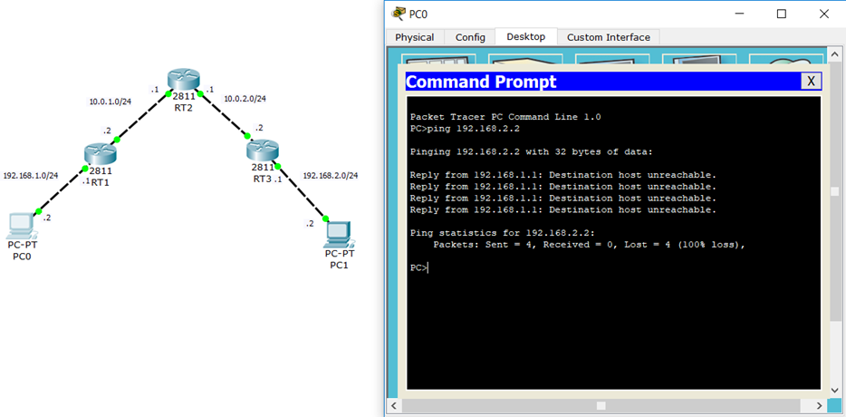
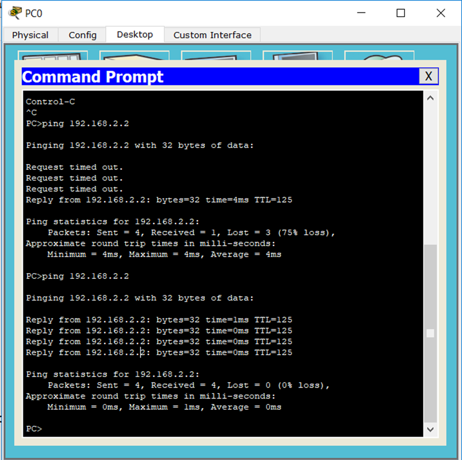

---
## Front matter
lang: ru-RU
title: Структура научной презентации
subtitle: Простейший шаблон
author:
  - Кулябов Д. С.
institute:
  - Российский университет дружбы народов, Москва, Россия
  - Объединённый институт ядерных исследований, Дубна, Россия
date: 01 января 1970

## i18n babel
babel-lang: russian
babel-otherlangs: english

## Formatting pdf
toc: false
toc-title: Содержание
slide_level: 2
aspectratio: 169
section-titles: true
theme: metropolis
header-includes:
 - \metroset{progressbar=frametitle,sectionpage=progressbar,numbering=fraction}
---

# Информация

## Докладчик

:::::::::::::: {.columns align=center}
::: {.column width="70%"}

  * Кулябов Дмитрий Сергеевич
  * д.ф.-м.н., профессор
  * профессор кафедры прикладной информатики и теории вероятностей
  * Российский университет дружбы народов
  * [kulyabov-ds@rudn.ru](mailto:kulyabov-ds@rudn.ru)
  * <https://yamadharma.github.io/ru/>

:::
::: {.column width="30%"}

:::
::::::::::::::

# Цель работы

- Целью работы по теме статической маршрутизации в интернете является изучение принципов и методов настройки статической маршрутизации, а также анализ ее преимуществ и недостатков в различных сетевых сценариях.

# Введение

- Статическая маршрутизация является одним из ключевых компонентов сетевой архитектуры, обеспечивающим передачу данных в интернете. В отличие от динамической маршрутизации, где маршруты автоматически обновляются и адаптируются к изменениям в сети, статическая маршрутизация предполагает ручное конфигурирование маршрутов администратором сети.

# Принципы работы

Статическая маршрутизация представляет собой метод управления передачей
данных в компьютерных сетях, который основывается на фиксированных маршрутах,
определяемых вручную администратором сети. Это противоположно динамической
маршрутизации, где маршруты автоматически обновляются с учетом текущего
состояния сети. В данном реферате будут рассмотрены основные принципы
статической маршрутизации, её механизмы работы, а также преимущества и
недостатки.

# Настройка статических маршрутов

Чтобы прописать статические маршруты на сервере Windows, необходимо
выполнить следующие шаги:
1. Подключитесь к серверу по RDP или через KVM-консоль.
2. Добавьте необходимые маршруты по одному:
route -p ADD <ip_address> MASK <mask> <gateway> METRIC <x>
Укажите:
- <ip_address> — подсеть, до которой нужен маршрут, например 192.168.0.0;
- <mask> — маска подсети, до которой нужен маршрут, например 255.255.255.0;
- <gateway> — шлюз для подсети текущего сервера, например шлюз, который
указан на глобальном роутере. Адрес шлюза должен быть в одной подсети
с сервером;
- <x> — параметр, определяющий приоритет указанного шлюза, 1 — наивысший
приоритет.

# Настройка статических маршрутов

# Настройка статических маршрутов

RT1#conf t
RT1(config)#ip route 192.168.2.0 255.255.255.0 10.0.1.1 

RT1#show ip route
Codes: C - connected, S - static, I - IGRP, R - RIP, M - mobile, B - BGP
 D - EIGRP, EX - EIGRP external, O - OSPF, IA - OSPF inter area
 N1 - OSPF NSSA external type 1, N2 - OSPF NSSA external type 2
 E1 - OSPF external type 1, E2 - OSPF external type 2, E - EGP
 i - IS-IS, L1 - IS-IS level-1, L2 - IS-IS level-2, ia - IS-IS inter area
 * - candidate default, U - per-user static route, o - ODR

# Настройка статических маршрутов

P - periodic downloaded static route
Gateway of last resort is not set
 10.0.0.0/24 is subnetted, 1 subnets
C 10.0.1.0 is directly connected, FastEthernet0/1
C 192.168.1.0/24 is directly connected, FastEthernet0/0
S 192.168.2.0/24 [1/0] via 10.0.1.1

Появился статический маршрут (о чем свидетельствует код S слева). Здесь
много различных параметров и о них я расскажу чуть позже. Сейчас задача
прописать маршруты на всех устройствах. Перехожу к RT2:
RT2(config)#ip route 192.168.1.0 255.255.255.0 10.0.1.2
RT2(config)#ip route 192.168.2.0 255.255.255.0 10.0.2.2
RT2#show ip route 

# Настройка статических маршрутов

Обратите внимание, что маршрут прописан не только в 192.168.2.0/24, но и
192.168.1.0/24. Без обратного маршрута полноценной связности не будет.
Остался RT3:
RT3(config)#ip route 192.168.1.0 255.255.255.0 10.0.2.1
RT3(config)#end
RT3#show ip route
Codes: C - connected, S - static, I - IGRP, R - RIP, M - mobile, B - BGP
 D - EIGRP, EX - EIGRP external, O - OSPF, IA - OSPF inter area
 N1 - OSPF NSSA external type 1, N2 - OSPF NSSA external type 2
 E1 - OSPF external type 1, E2 - OSPF external type 2, E - EGP
 i - IS-IS, L1 - IS-IS level-1, L2 - IS-IS level-2, ia - IS-IS inter area
 * - candidate default, U - per-user static route, o - ODR
 P - periodic downloaded static route
Gateway of last resort is not set
 - 
# Настройка статических маршрутов

# Сравнение динамической и статической маршрутизации
Сравнивая преимущества и недостатки подходов, в действительности говорить
о том, что лучше, а что хуже было бы не совсем корректно, поскольку, по сути,
эти виды маршрутизации используются для разных целей.
Например, настроить постоянный удаленный доступ к ПК или серверу
возможно только через статическую маршрутизацию.

# Выводы

Статическая маршрутизация является важным аспектом сетевого администрирования,
обеспечивая надежный и предсказуемый способ передачи данных в интернете. Этот
метод маршрутизации, основанный на фиксированных таблицах маршрутов,
позволяет администраторам точно контролировать пути, по которым проходят пакеты
данных, что особенно полезно в небольших или стабильных сетях.

# Список литературы{.unnumbered}

::: {#refs}
:::

