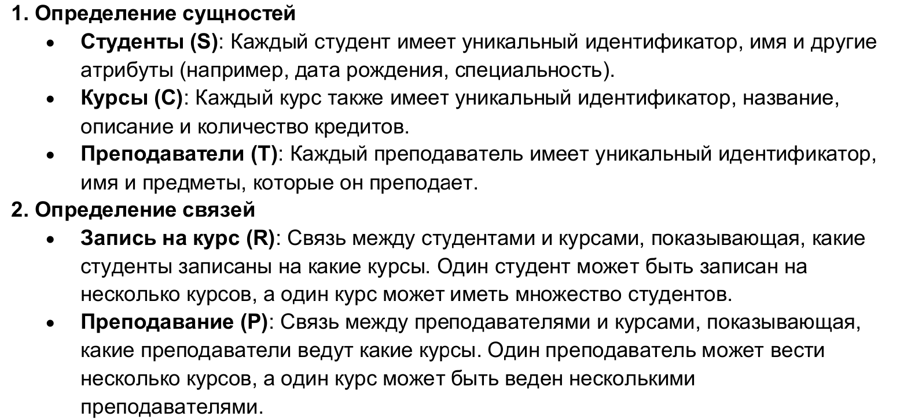
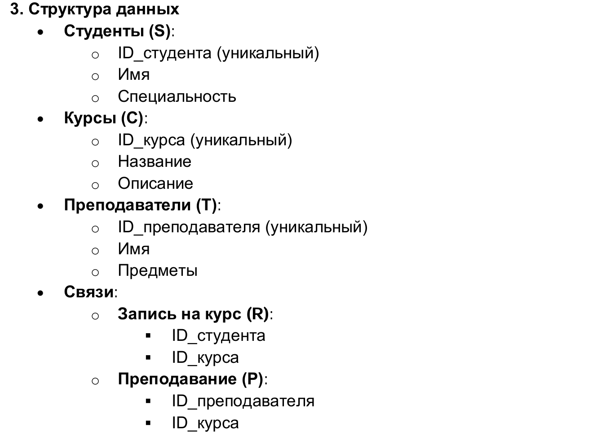
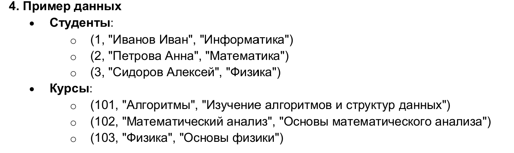
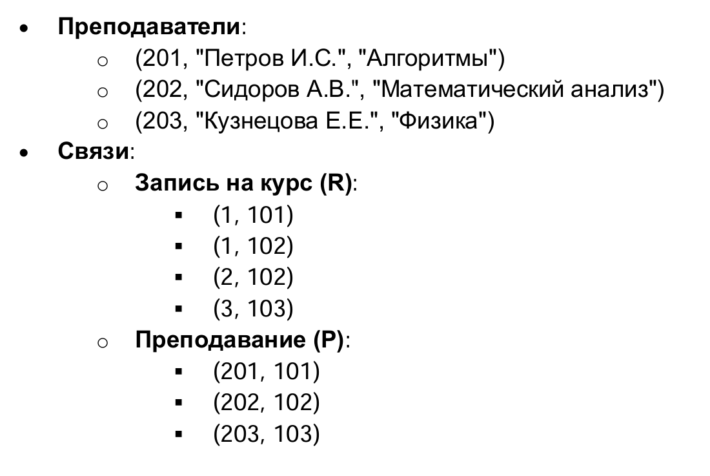
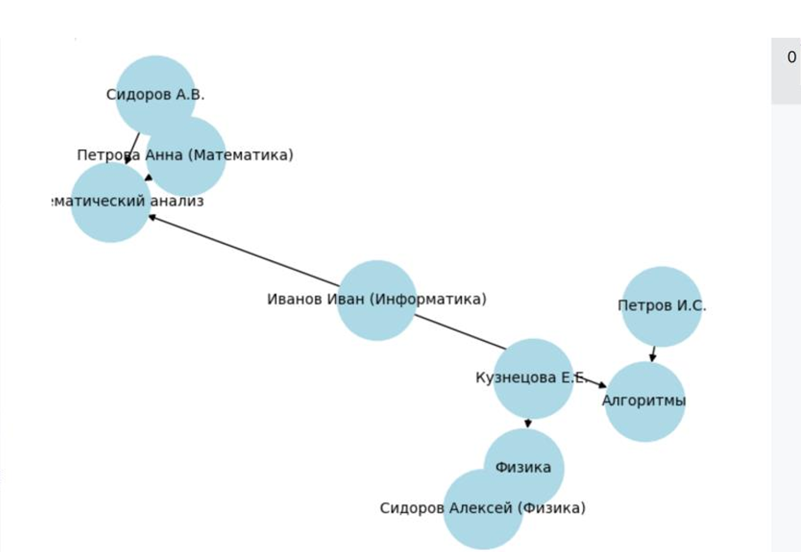

---
## Front matter
lang: ru-RU
title: Доклад
subtitle: Сетевые модели
author:
  - Коннова Т. А.
institute:
  - Российский университет дружбы народов, Москва, Россия
date: 2025-05-03

## i18n babel
babel-lang: russian
babel-otherlangs: english

## Formatting pdf
toc: false
toc-title: Содержание
slide_level: 2
aspectratio: 169
section-titles: true
theme: metropolis
header-includes:
 - \metroset{progressbar=frametitle,sectionpage=progressbar,numbering=fraction}
---

# Информация

## Докладчик

:::::::::::::: {.columns align=center}
::: {.column width="70%"}

  * Коннова Татьяна Алексеевна
  * студент
  * Российский университет дружбы народов

:::
::: {.column width="30%"}

:::
::::::::::::::

# Вводная часть

## Цель работы

- Целью работы по теме сетевых моделей является исследование различных подходов 
и методов построения сетей для оптимизации передачи данных и повышения 
эффективности управления сетевыми ресурсами.

## Введение

- В современном мире сетевые технологии играют ключевую роль в обеспечении связи, 
обработки данных и обмена информацией. Сетевые модели служат основой для 
проектирования и реализации компьютерных сетей, позволяя структурировать 
сложные системы и оптимизировать процессы передачи данных.

## Принципы работы

Принципы работы сетевых моделей с примерами 
Сетевые модели, такие как OSI и TCP/IP, организуют взаимодействие между 
компонентами сетей, используя несколько ключевых принципов:

- Модульность 
- Интерфейсы
- Стандартизация
- Абстракция
- Службы и функции

## Разница между иерархической моделью данных и сетевой моделью

Разница между иерархической моделью данных и сетевой моделью 
заключается в структуре и способах организации данных. В иерархических 
структурах каждая запись-потомок должна иметь ровно одного предка, что 
создает строгую иерархию, подобную древовидной структуре. Это означает, что 
данные организованы в виде единого дерева, где каждое узловое значение 
имеет только одну "родительскую" запись, что ограничивает гибкость в 
представлении сложных взаимосвязей. 

## История

Сетевая модель была одним из первых подходов, использовавшимся при создании 
баз данных в конце 50-х — начале 60-х годов. Активным пропагандистом этой модели 
был Чарльз Бахман. Идеи Бахмана послужили основой для разработки стандартной 
сетевой модели под эгидой организации CODASYL.

## История

## Сетевая СУБД

Сетевая СУБД — это СУБД, построенная на основе сетевой модели данных. 
К основным понятиям сетевой модели базы данных относятся: уровень, элемент 
(узел), связь. 
Узел — это совокупность атрибутов данных, описывающих некоторый объект. На 
схеме иерархического дерева узлы представляются вершинами графа. В сетевой 
структуре каждый элемент может быть связан с любым другим элементом. 

## Сетевая СУБД

## Модель "Студенты, Курсы и Преподаватели" 

## Модель "Студенты, Курсы и Преподаватели" 

## Модель "Студенты, Курсы и Преподаватели" 

## Модель "Студенты, Курсы и Преподаватели" 

## Модель "Студенты, Курсы и Преподаватели" 

## Выводы

- Сетевые модели данных представляют собой важный этап в эволюции систем управления базами данных. Они позволяют эффективно организовывать и представлять данные в виде узлов и связей, что обеспечивает гибкость и возможность сложных запросов. Одним из главных преимуществ сетевых моделей является их способность обрабатывать сложные отношения между данными, что делает их подходящими для приложений с высокой степенью взаимосвязанности.